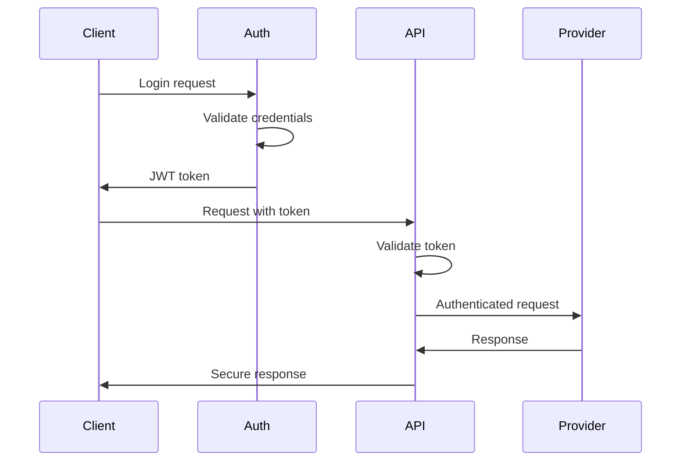

# System Architecture

This document describes the architecture of CCH Axcess Intelligence Vibed, including the feature-based organization, dependency rules, and design principles.

## Overview

The application follows a **feature-based architecture** with clear separation of concerns and well-defined module boundaries. This approach promotes:

- **Scalability**: Easy to add new features without affecting existing ones
- **Maintainability**: Clear ownership and responsibility boundaries
- **Testability**: Isolated features can be tested independently
- **Team Collaboration**: Multiple developers can work on different features simultaneously

## Architecture Diagram

```mermaid
graph TB
    subgraph "Presentation Layer"
        UI[UI Components]
        Pages[Pages/Screens]
        Routes[Routing]
    end
    
    subgraph "Feature Layer"
        Chat[Chat Feature]
        Docs[Documents Feature]
        Research[Research Feature]
        Auth[Auth Feature]
    end
    
    subgraph "Shared Layer"
        SharedComponents[Shared Components]
        SharedHooks[Shared Hooks]
        SharedUtils[Shared Utils]
        SharedTypes[Shared Types]
    end
    
    subgraph "Core Layer"
        Providers[AI Providers]
        Config[Configuration]
        Constants[Constants]
        Models[Domain Models]
    end
    
    subgraph "Infrastructure Layer"
        API[API Client]
        Auth2[Authentication]
        Monitoring[Monitoring]
        Storage[Storage]
    end
    
    subgraph "External Services"
        Anthropic[Anthropic API]
        OpenAI[OpenAI API]
        CCH[CCH Services]
    end
    
    UI --> Chat
    UI --> Docs
    UI --> Research
    UI --> Auth
    
    Chat --> SharedComponents
    Docs --> SharedComponents
    Research --> SharedComponents
    Auth --> SharedComponents
    
    SharedComponents --> SharedHooks
    SharedHooks --> SharedUtils
    
    Chat --> Core
    Docs --> Core
    Research --> Core
    
    Core --> Infrastructure
    Infrastructure --> External Services
```

## Directory Structure

```
src/
├── features/              # Feature modules (business logic)
│   ├── chat/             # Chat functionality
│   │   ├── components/   # Feature-specific components
│   │   ├── hooks/        # Feature-specific hooks
│   │   ├── services/     # Feature-specific services
│   │   ├── stores/       # Feature-specific state
│   │   ├── types/        # Feature-specific types
│   │   └── index.ts      # Feature public API
│   ├── documents/        # Document management
│   ├── research/         # Tax research
│   └── auth/            # Authentication (future)
├── shared/               # Shared resources
│   ├── components/       # Reusable UI components
│   ├── hooks/           # Reusable React hooks
│   ├── services/        # Common services
│   ├── types/           # Shared type definitions
│   ├── utils/           # Utility functions
│   └── index.ts         # Shared public API
├── core/                # Core business logic
│   ├── providers/       # AI service providers
│   ├── config/          # Configuration management
│   ├── constants/       # Application constants
│   ├── models/          # Domain models
│   └── index.ts         # Core public API
├── infrastructure/      # Technical infrastructure
│   ├── api/            # HTTP client & API setup
│   ├── auth/           # Auth infrastructure
│   ├── monitoring/     # Logging & monitoring
│   └── index.ts        # Infrastructure public API
├── security/            # Security utilities
├── App.tsx             # Application root
└── index.tsx           # Application entry point
```

## Dependency Rules

### Strict Dependency Hierarchy

The following dependency rules MUST be enforced:

1. **Features → Shared + Core + Infrastructure**
   - Features can import from shared, core, and infrastructure
   - Features CANNOT import from other features

2. **Shared → Core + Infrastructure**
   - Shared modules can import from core and infrastructure
   - Shared modules CANNOT import from features

3. **Core → Infrastructure**
   - Core can import from infrastructure
   - Core CANNOT import from features or shared

4. **Infrastructure → External**
   - Infrastructure can import external libraries
   - Infrastructure CANNOT import from features, shared, or core

### Import Rules

```typescript
// ✅ ALLOWED - Feature importing from shared, core, infrastructure
import { Button } from '@/shared/components';
import { ConfigService } from '@/core/config';
import { ApiClient } from '@/infrastructure/api';

// ❌ FORBIDDEN - Feature importing from another feature
import { DocumentService } from '@/features/documents';

// ✅ ALLOWED - Shared importing from core
import { ProviderFactory } from '@/core/providers';

// ❌ FORBIDDEN - Shared importing from features
import { ChatService } from '@/features/chat';
```

## Feature Architecture

### Feature Structure

Each feature follows a consistent internal structure:

```
features/[feature-name]/
├── components/          # React components
│   ├── [FeatureName]Interface.tsx
│   ├── [ComponentName].tsx
│   └── index.ts
├── hooks/              # Custom hooks
│   ├── use[FeatureName].ts
│   ├── use[Functionality].ts
│   └── index.ts
├── services/           # Business logic services
│   ├── [FeatureName]Service.ts
│   ├── [Specific]Service.ts
│   └── index.ts
├── stores/             # State management
│   ├── [featureName]Store.ts
│   └── index.ts
├── types/              # Type definitions
│   ├── index.ts
│   └── [specific].types.ts
├── constants.ts        # Feature constants
└── index.ts           # Public API (barrel export)
```

### Barrel Exports

Each feature exposes a clean public API through barrel exports:

```typescript
// features/chat/index.ts
export { ChatInterface } from './components/ChatInterface';
export { useChat } from './hooks/useChat';
export { ChatService } from './services/ChatService';
export type { ChatMessage, ChatSession } from './types';
```

### Feature Communication

Features communicate through:

1. **Shared State**: Using shared stores/context
2. **Events**: Using event bus pattern
3. **Services**: Through shared services layer
4. **URL/Routing**: For navigation between features

```typescript
// Example: Document feature notifying chat feature
import { EventBus } from '@/shared/services';

// In documents feature
EventBus.emit('document:processed', { documentId, content });

// In chat feature
EventBus.on('document:processed', (data) => {
  // Handle document processing completion
});
```

## Shared Module Design

### Component Organization

```
shared/components/
├── ui/                 # Basic UI elements
│   ├── Button/
│   ├── Input/
│   └── Modal/
├── layout/             # Layout components
│   ├── Header/
│   ├── Sidebar/
│   └── Container/
├── forms/              # Form-related components
│   ├── Form/
│   ├── FormField/
│   └── FileUpload/
└── feedback/           # User feedback components
    ├── Toast/
    ├── Alert/
    └── Notification/
```

### Hook Categories

```
shared/hooks/
├── api/                # API-related hooks
├── state/              # State management hooks
├── ui/                 # UI interaction hooks
├── form/               # Form handling hooks
└── utility/            # General utility hooks
```

## Core Module Design

### Provider Pattern

AI providers implement a common interface:

```typescript
interface AIProvider {
  sendMessage(message: string, options?: SendOptions): Promise<AIResponse>;
  streamMessage(message: string, options?: SendOptions): AsyncIterator<AIChunk>;
  isAvailable(): boolean;
  getModels(): Model[];
}

// Implementations
class AnthropicProvider implements AIProvider { ... }
class OpenAIProvider implements AIProvider { ... }
```

### Configuration Management

```typescript
// Centralized configuration
const config = ConfigManager.getInstance();

// Environment-specific settings
const isDev = config.isDevelopment();
const apiUrl = config.get('api.url');
const features = config.getFeatureFlags();
```

## Infrastructure Design

### API Client Architecture

```typescript
// Layered API client with interceptors
const apiClient = new ApiClient({
  baseURL: config.apiUrl,
  interceptors: {
    request: [authInterceptor, loggingInterceptor],
    response: [errorInterceptor, cacheInterceptor]
  }
});
```

### Monitoring & Observability

```typescript
// Structured logging
Logger.info('User action', {
  userId: user.id,
  action: 'document_upload',
  metadata: { fileSize, fileName }
});

// Error tracking
ErrorReporter.captureException(error, {
  context: 'chat_message_send',
  extra: { messageId, provider }
});

// Performance monitoring
PerformanceMonitor.startTimer('document_processing');
// ... processing logic
PerformanceMonitor.endTimer('document_processing');
```

## Security Architecture

### Input Sanitization

All user inputs are sanitized at the boundary:

```typescript
// At API boundary
app.use(express.json({
  limit: '10mb',
  verify: (req, res, buf) => {
    req.rawBody = buf;
  }
}));

// At component boundary
const sanitizedInput = sanitizeInput(userInput, 'html');
```

### Authentication Flow



## Performance Considerations

### Code Splitting

Features are loaded on-demand:

```typescript
// Lazy loading of features
const ChatFeature = lazy(() => import('@/features/chat'));
const DocumentsFeature = lazy(() => import('@/features/documents'));
```

### Memoization Strategy

```typescript
// Component memoization
const ChatMessage = memo(({ message }) => {
  // Component implementation
});

// Hook memoization
const chatService = useMemo(() => 
  new ChatService(config), [config]
);
```

### Virtual Scrolling

For large datasets:

```typescript
const VirtualMessageList = () => {
  const { items, scrollElementProps } = useVirtualList({
    items: messages,
    itemHeight: 80,
    containerHeight: 400
  });
  
  return (
    <div {...scrollElementProps}>
      {items.map(item => (
        <MessageItem key={item.id} message={item.data} />
      ))}
    </div>
  );
};
```

## Testing Strategy

### Unit Testing

Each layer has focused unit tests:

```typescript
// Feature unit tests
describe('ChatService', () => {
  it('should send message successfully', async () => {
    const service = new ChatService(mockConfig);
    const result = await service.sendMessage('test');
    expect(result.success).toBe(true);
  });
});

// Shared unit tests
describe('sanitizeInput', () => {
  it('should remove script tags', () => {
    const input = '<script>alert("xss")</script>Hello';
    const result = sanitizeInput(input, 'html');
    expect(result).toBe('Hello');
  });
});
```

### Integration Testing

Cross-layer integration tests:

```typescript
describe('Chat Integration', () => {
  it('should handle end-to-end message flow', async () => {
    // Test feature → shared → core → infrastructure
    const chatInterface = render(<ChatInterface />);
    fireEvent.change(input, { target: { value: 'test message' } });
    fireEvent.click(sendButton);
    
    await waitFor(() => {
      expect(mockApiClient.post).toHaveBeenCalled();
    });
  });
});
```

## Deployment Architecture

### Environment Configuration

```typescript
// Environment-specific builds
const config = {
  development: {
    apiUrl: 'http://localhost:3001',
    debug: true,
    csp: 'development'
  },
  production: {
    apiUrl: 'https://api.production.com',
    debug: false,
    csp: 'strict'
  }
};
```

### Build Optimization

```typescript
// Vite configuration for optimal builds
export default defineConfig({
  build: {
    rollupOptions: {
      output: {
        manualChunks: {
          'vendor': ['react', 'react-dom'],
          'features': ['src/features'],
          'shared': ['src/shared']
        }
      }
    }
  }
});
```

## Migration Strategy

### Gradual Migration

The current codebase can be migrated incrementally:

1. **Phase 1**: Create new feature structure alongside existing code
2. **Phase 2**: Move shared utilities to shared module
3. **Phase 3**: Migrate features one by one
4. **Phase 4**: Remove old structure and update imports

### Import Mapping

```typescript
// Create import mappings for gradual migration
const importMap = {
  '@/screens/Home': '@/features/chat/components/ChatInterface',
  '@/components/ui': '@/shared/components/ui',
  '@/services/api-client': '@/infrastructure/api/ApiClient'
};
```

---

*This architecture enables scalable, maintainable, and testable code while supporting team collaboration and feature independence.*